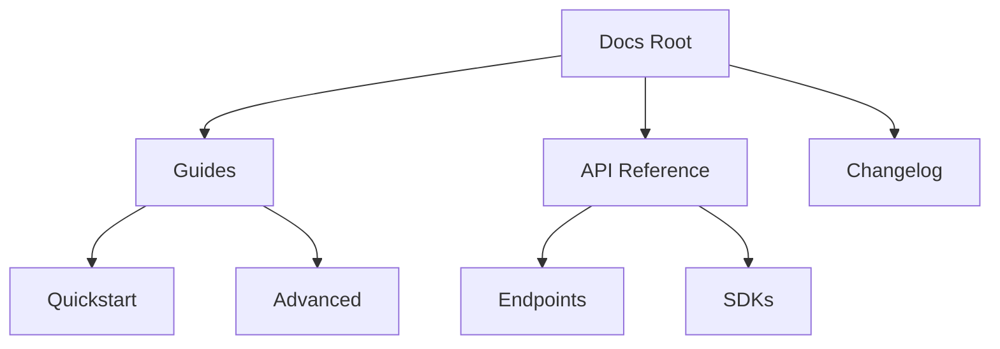

## Overview

Organize your project documentation effectively to improve navigation and collaboration. Use pages, folders, and hierarchies to create a logical structure. Follow these practices to keep your `Kiran Maadamshetti Documentation` space maintainable and scalable.

<Columns cols={3}>
  <Card title="Create Pages" icon="file-text" href="#">
    Build new documentation pages quickly.
  </Card>
  <Card title="Folder Structure" icon="folder" href="#">
    Organize content with nested folders.
  </Card>
  <Card title="Collaborate" icon="users" href="#">
    Invite team members and manage permissions.
  </Card>
</Columns>

## Creating and Editing Pages

Start by creating pages for specific topics. Access the dashboard and select **New Page** to begin.

<Steps>
  <Step title="Create a Page" icon="plus">
    Navigate to your documentation root or a folder. Click **New Page**, enter a title like "Quickstart Guide", and select the MDX format.
  </Step>
  <Step title="Edit Content" icon="edit-3">
    Open the page editor. Add frontmatter, headings, and components. Preview changes in real-time.
  </Step>
  <Step title="Publish" icon="upload">
    Save and publish. Changes go live immediately for viewers.
  </Step>
</Steps>

<Callout kind="tip">
  Always use YAML frontmatter with `title` and `description` for better SEO and navigation.
</Callout>

## Using Folders and Hierarchies

Structure your content with folders to reflect your project's architecture. Create nested hierarchies for guides, APIs, and references.



| Structure Level | Best Use Case | Example Path |
|-----------------|---------------|--------------|
| Root Folders    | Major sections | `/guides/`, `/api/` |
| Subfolders      | Topics        | `/guides/quickstart.mdx` |
| Pages           | Specific docs | `/api/users.mdx` |

<Expandable title="Advanced Hierarchy Tips" default-open="false">

Maintain flat structures where possible—avoid more than 3 levels deep. Use index pages with `<Columns>` of `<Card>` components for navigation.

</Expandable>

## Collaboration Features

Enable team access to streamline reviews and updates. Manage permissions at folder or page level.

<Tabs>
  <Tab title="Invite Collaborators" icon="user-plus">
    Go to **Settings > Team**. Enter emails and assign roles: **Editor** (edit/publish), **Viewer** (read-only).

    ```javascript
    // Example invite API (if using CLI)
    await docs.inviteUser("team@example.com", "editor");
    ```
  </Tab>
  <Tab title="Review Changes" icon="eye">
    Use version history to compare edits. Approve or revert as needed.

    <CodeGroup tabs="CLI,Web">
      ```bash
      docs diff --page quickstart.mdx --since yesterday
      ```
      ```javascript
      // Web UI equivalent
      const changes = await docs.getChanges("quickstart.mdx");
      console.log(changes);
      ```
    </CodeGroup>
  </Tab>
  <Tab title="Permissions" icon="shield">
    Set granular access: full for `/guides/`, read-only for `/api/`.

    | Role     | Create | Edit | Publish | Delete |
    |----------|--------|------|---------|--------|
    | Editor   | Yes    | Yes  | Yes     | No     |
    | Viewer   | No     | No   | No      | No     |
  </Tab>
</Tabs>

<Callout kind="alert">
  Review all changes before publishing to sensitive areas like API docs.
</Callout>

Follow these steps to build a robust documentation system that grows with your project. Regular audits ensure content stays current and accessible.